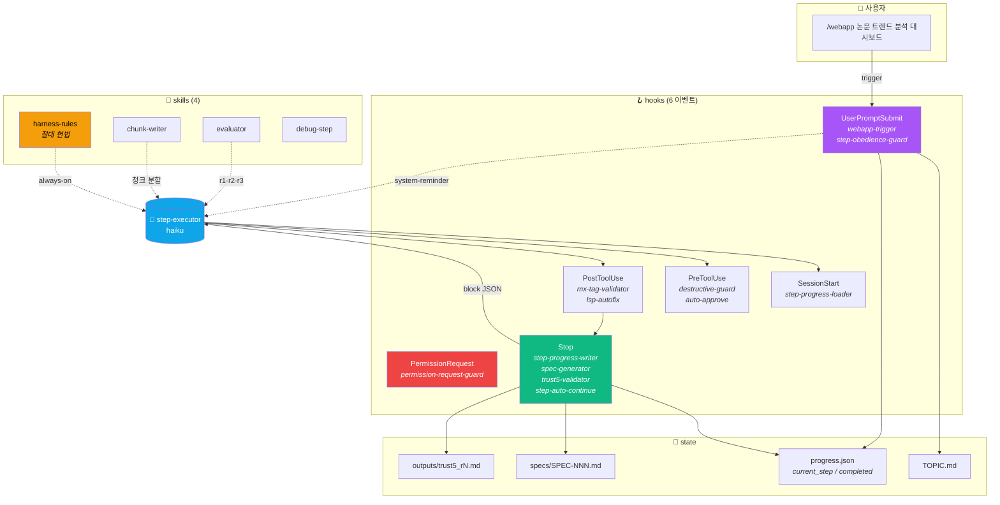
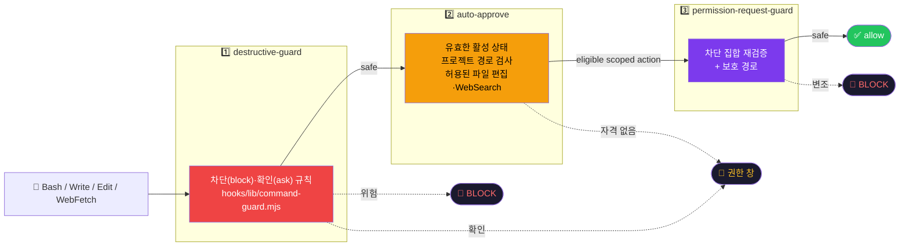
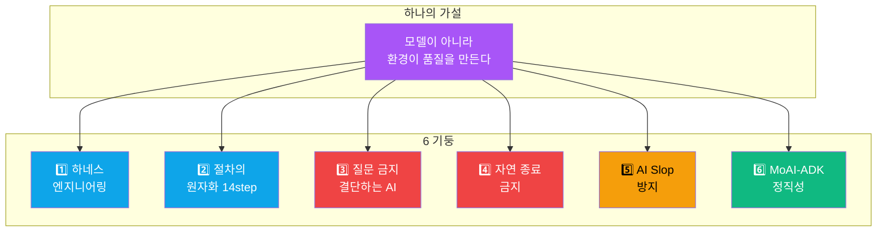
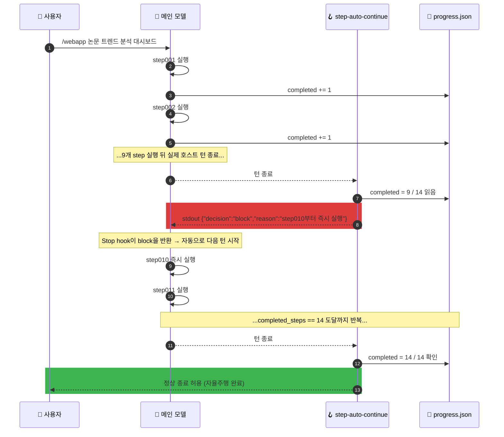

<div align="center">

# harness14

공개 저장소 이름은 기본14단계에 맞춰 `harness14`로 변경했습니다. 설치 이름은 `harness20@harness20`이며 `/harness20:webapp`·`$harness20:webapp` 등 기존 명령과 실행 기록을 유지합니다. 아래 설치 안내의 GitHub 주소는 새 저장소를 가리킵니다.

### 한 줄 요청 → 기획부터 14 step 자율주행 → 인터랙티브 웹 튜토리얼 1편

최신 릴리스: **[v4.2.0](https://github.com/Technoetic/harness14/releases/tag/v4.2.0)**. 새 실행은 기본14단계와 Tower 기반 조건 고정·오프라인 비교·민감 본문 없는 이력 추출을 제공합니다. 실제 검증 범위와 결과는 [릴리스 안내](docs/releases/v4.2.0.md)와 [검증 JSON](https://github.com/Technoetic/harness14/releases/download/v4.2.0/verification.json)에서 확인합니다.

**`/harness20:webapp 논문 트렌드 분석 대시보드`** 한 줄을 던지면 요구사항 기획부터 14단계 완료나 명명된 멈춤 전까지 이어가는 결정론적 절차가 가동된다.<br/>
모델을 똑똑하게 만드는 대신 **모델이 놓을 트랙을 좁힌다**.

<br/>

[](https://github.com/Technoetic/harness14)
[](LICENSE)
[](#-claude-code-설치)
[](hooks/)
[](assets/profiles/planning-first-14-v1/steps/)

[](tests/security-regression.sh)
[](hooks/)
[](skills/harness-rules/SKILL.md)

<br/>


<sub>데모 캐스트는 legacy 107단계 완주 실기록이다(원본은 <a href="https://github.com/Technoetic/harness14/tree/legacy-107"><code>legacy-107</code></a> 태그). v2.0에서 50단계로 줄였고, v2.13.0의 새 실행은 조사 14단계를 제거한 36단계를 사용한다.</sub>

</div>

---

## Verified experience memory

Local auxiliary memory preserves sanitized failures and QA-backed repair lessons.
Explicit CLIs inspect applicable advice, retrieve digest-pinned bounded context,
validate declared work units/reads/checkpoints, and record actual later outcomes.
Advice grants no execution, approval or completion authority; counts, receipts
and existing step contracts remain with the state manager. No provider, installed
settings, network service or automatic SessionStart memory injection is added.
See [requests, schemas, limits and reference scope](docs/experience-memory.md).
Generationless legacy workflows return an explicit unsupported memory result;
their existing execution remains available. The offline evaluator is a public
synthetic fixture, not an LLM or business-performance benchmark.

## OWASP 보안 철학과 적용 범위

**모델이 악성 지시를 따를 수 있다는 전제에서, 실행 권한과 신뢰 경계를 호스트 코드가 강제합니다.** 웹·PDF·소스 문서 같은 외부 입력과 Jev의 응답은 자료·참고 판단입니다. 현재 사용자가 허용한 작업 범위, 도구·경로 접근, 입력의 무결성과 실행 한도를 임의로 바꿀 수 없습니다.

사용자가 제공한 **OWASP LLM Top 10 2026 문서**를 기준으로 다음 통제를 보강했습니다. 공식 최종판 확인이나 OWASP 인증·완전한 보호를 주장하지 않습니다.

| 보안 영역 | 적용한 호스트 통제 |
|---|---|
| 프롬프트 주입·과도한 자율성 | 등록된 도구의 인자·경로·범위 검사, 민감 경로 보호, 호스트 권한 정책 적용, 새 실행의 TOPIC 해시 고정·검증 |
| 민감 정보·숨은 컨텍스트 노출 | 선택한 발췌만 크기를 제한해 전송, 자격 증명 필터, 자식 프로세스의 최소 환경·로그 정리 |
| 공급망·입력/증거 오염 | 검토한 의존성 버전·무결성·출처 검사, 설치 lifecycle 스크립트 배제, 소스·설정·실행 세대에 연결된 현재 증거 검사 |
| 무제한 소비·잘못된 정보 | 프로세스·API 키 간 공유하는 영속 Jev 사용량 예약, 반복·입출력·시간 상한, 보류·낮은 확신도 검토, 실제 측정 근거 요구 |
| 부적절한 출력 처리 | 엄격한 응답 스키마와 shell 확장 없는 argv 실행, 생성 HTML 실행 전 호스트 TCP/UDP 전체 전송 경로의 네트워크 격리 요구 |

**현재 네이티브 브라우저 어댑터는 필요한 격리를 제공하지 못하므로 생성 HTML 실행을 차단합니다.** CI의 신뢰된 브라우저 fixture 통과는 생성물의 네이티브 미리보기 지원을 뜻하지 않습니다.

벡터 검색·임베딩·시맨틱 캐시·모델 학습 데이터 수집은 현재 플러그인에 없습니다. 추가할 때는 별도 위협 모델과 검증이 필요합니다. OS 권한·네트워크 접근 정책·서비스 과금 상한·비공개 업무 정보 보호와 변경된 훅의 수동 신뢰 검토는 호스트·운영자가 관리합니다.

**v4.0.0 당시 검증 근거:** 릴리스 커밋 `a6966675cb1f8dc90a2eb8d533bcb7f2664ec6e4`과 동일한 소스 트리를 PR·main·태그에서 Windows/macOS/Linux × Node 22/24로 검사해, 합계 **18개 CI 작업이 성공**했습니다. 각 작업에서 Claude 회귀 252개와 신뢰된 브라우저 fixture 45개가 통과했습니다. 환경별 제외와 실제 설치·공개 ZIP의 바이트 검증은 [릴리스 검증 JSON](https://github.com/Technoetic/harness14/releases/download/v4.0.0/verification.json)에 기록했습니다. 이 결과는 당시 기본20단계 소스의 릴리스 검증 범위에 한합니다. 실제 프로젝트의 20단계 완주나 v4.2.0의 새14단계 실행 결과를 보증하지 않습니다.

[위험 10개별 통제·잔여 한계·향후 통합 조건](docs/SECURITY.md) · [의존성 검증 명령](docs/SECURITY.md#host-and-deployment-responsibilities): `npm --ignore-scripts run verify:security`

---

## Workflow profiles / 새14와 기존20·36·50

공개 저장소 이름은 **harness14**입니다. 기존 설치와 명령의 호환성을 위해
플러그인·마켓플레이스 ID는 **harness20**을 유지합니다. 새 실행은 schema2
`planning-first-14-v1`의 **14단계**를 사용합니다. 이전 기본20의 step3–8을
독립 단계에서 제거하고 환경 준비는 설계2의 마지막으로, 작업 단위 소유권과
UTF-8 무BOM·LF 작성 규칙은 구현3으로, 실제 바이트 검사는 빌드4로 옮겼습니다.
설계의 독립 PASS 이후에만 환경 준비를 수행하며, 환경 보고서·유효한 브라우저
잠금·실제 준비 증거가 없으면 구현에 진입하지 않습니다. 의존성 설치는 필요한
선언 항목에 한해 정상 권한 흐름으로 수행합니다.

TOPIC의 사용자 원문·여섯 필드와 해시는 유지합니다. 없는 API 계약이나 입력은
누락으로 남기며, 기획·설계가 현재 외부 사실을 확인했다고 추정하지 않습니다.
Codex는 `begin.step_target`, Claude는 resolver의 `step_body`를 읽습니다.
새 본문은 `assets/profiles/planning-first-14-v1/steps/`와
`codex/assets/profiles/planning-first-14-v1/steps/`, Claude 보관 본문은
`step_archive/profiles/planning-first-14-v1/archived/`에 있습니다.

기존 `planning-first-20-v1`, `research-free-36-v1`, `legacy-50-v1`과
미표식 schema-v1의50단계 실행은 번호·본문·해시·pause/resume·완료 영수증을
유지합니다. 새 기본값으로 기존 실행을 재해석하지 않습니다. Codex reset 이후
새 시작은14를 선택하고, Claude reset은 기존 실행의 선택 프로필을 보존합니다.
손상된 상태나 바인딩은 일관된 기록을 복원한 뒤 진행합니다.

| 새 단계 | 원번호 | 역할 |
| --- | --- | --- |
| 1 | 25 | 요구사항 기획 |
| 2 | 30 | 통합 설계·독립 PASS 후 환경 준비·브라우저 잠금 |
| 3 | 37 | 작업 단위 소유권 선언·구현·인코딩 규칙 |
| 4 | 38 | 빌드·바이트 검사·품질1 |
| 5 | 39 | 독립 레이아웃 검증 |
| 6 | 41 | JavaScript 모듈 분리 |
| 7 | 42 | CSS 분리 |
| 8 | 44 | 라우팅 통합·품질2 |
| 9 | 45 | E2E |
| 10 | 46 | 독립 스크린샷 E2E |
| 11 | 47 | 독립 키보드 검증 |
| 12 | 48 | 독립 마우스 검증 |
| 13 | 49 | 최종 설계 검증 |
| 14 | 50 | 최종 빌드·전체 회귀·품질3 |

품질은 **4·8·14**, 독립 QA는 **5·10·11·12**, Jev는 **1·2·3·9·13**입니다.
기존20의 품질10·14·20과 QA11·16·17·18, 기존36/50 좌표는 유지합니다.
필수 finding, 최대5라운드와 접근성·키보드·마우스·회귀 기준도 유지합니다.

현재 브라우저 검증기는 생성 HTML의 호스트 네트워크 격리 어댑터가 없으면
`FAIL`로 차단합니다. 이 제약을 단계 축소로 해제하지 않습니다. 상태 기계의
합성14/14 시험은 실제 브라우저·실모델·배포 완료의 증거가 아닙니다.

### Tower에서 가져온 실행 비교 기능

명시적 오프라인 도구 [workflow-trials](docs/workflow-trials.md)는 실행 조건과
선택 근거를 고정하고, 같은 조건의 baseline/candidate 관측을 비교하며, 민감한
본문을 제외한 현재 Codex 영수증 구조를 추출합니다. QA·근거가 낡았거나 한쪽
관측이 없거나 중대한 오류가 있으면 비교를 보류합니다. 기록된 수치는 호출자가
관측한 값이며, 도구 자체가 모델을 실행하거나 업무 효과를 측정하지 않습니다.
비교 결과는 기존 품질·QA·완료 판정의 권한을 대신하지 않습니다.

## Host commands / 호스트 명령

같은 기본14단계 절차를 사용하지만 호출 방식과 권한 모델은 호스트별로 다릅니다.

| Host | Start | Status | Reset |
|---|---|---|---|
| Claude Code | `/harness20:webapp <topic>` | `/harness20:harness-status` | `/harness20:harness-reset` |
| Codex | `$harness20:webapp <topic>` | `$harness20:harness20-status` | `$harness20:harness20-reset` |

짧은 이름도 사용할 수 있습니다: Claude Code의 `/webapp`, `/harness-status`, `/harness-reset`과 Codex의 `$webapp`, `$harness20-status`, `$harness20-reset`. 각 시작 명령에는 주제를 붙입니다.

Codex does not provide a `/webapp` slash command. Codex에서 기존 작업을 이어가려면 `$webapp resume`, 자동 이어가기를 멈추려면 `$webapp pause`를 사용합니다.

Claude Code에서 자동 이어가기를 멈추려면 `/harness-pause`, 멈춘 작업을 이어가려면 `/harness-resume`을 사용합니다. `/harness-reset`은 진행 기록을 새로 만들고 `/webapp <topic>`은 완료 기록이 있는 진행을 건드리지 않으므로 둘 다 재개 수단이 아닙니다.

플러그인 이름이 표시되는 Codex에서는 `$harness20:webapp`, `$harness20:harness20-status`, `$harness20:harness20-reset`을 선택합니다. 짧은 이름과 같은 제어 요청으로 처리됩니다.

Codex의 새 작업은 한 줄 주제로 시작할 수 있습니다. 초기화 관리자가 원문과 명시 조건을 보존하면서 여섯 필수 주제 항목을 준비하고, 미지정 항목만 기본값으로 표시한 뒤 해시를 고정합니다. 완성된 Markdown/YAML 주제는 바이트 그대로 보존하며, 기존 workflow의 주제는 변경하지 않습니다.

`$harness20:webapp <주제>`를 한 번 입력하면 현재 대화에서 검증된 단계를 순서대로 진행합니다.
각 단계의 증거와 완료 기록을 저장한 뒤 상태 관리자가 반환한 다음 단계로 바로 이어갑니다.
단계 완료 때마다 최종 응답이나 추가 `resume` 입력을 요구하지 않습니다. 현재 대화 내 실행은
Stop 후크 없이 동작하며, 전체 완료·사용자 일시정지·실제 입력 대기·차단 상태에서 멈춥니다.
같은 주제의 기존 작업은 보존한 채 재개합니다. 상세 동작은 [Codex 안내서](codex/README.md)를 참고하세요.

## Jev-first / 지원되는 판단 우선 위임

“가능한 판단은 Jev에 먼저 맡겨”처럼 Jev-first를 요청하면 일반 대화·산술을 포함해
현재 요청의 지원되는 판단을 먼저 Jev에 보냅니다. 적용 범위는 아래 체크포인트에 한정되지 않습니다.
Codex는 직접 Jev 질문이나 이미 승인된 Jev-first 선호에도 webapp 스킬을 선택하며,
워크플로 제어 요청이 없으면 직접 답변만 처리합니다. `$webapp` 시작 명령은 필요 없습니다.
기존 전송 승인 범위는 재사용하며, 파일 없는 질문은 `scripts/jev-ask.mjs`의
`prepare|run --input -`로 처리합니다. `run`에는 `--allow-network`가 필요합니다.

Noul은 참 확률, Choice는 보류 선택지를 갖춘 후보 선택, Score는 순서 있는 기준의
가중 평점입니다. 자유 생성·실제 도구 실행은 호스트가 담당하며, 미지원·실패·불확실한
결과는 이유와 함께 호스트 검토로 이어집니다. `Jev 사용`과 `호스트 처리`를 구분해 알립니다.
파일 검토의 기존 출처 제한과 모든 테스트·완료 절차는 유지합니다.
사용 예와 전송 범위는 [Jev-first 직접 질문 안내](docs/jev-first.md)를 참고하세요.

## Jev checkpoints / 새14의 5개 의미 판단

Jev 사용과 선택 자료의 외부 전송이 승인된 작업에서는 Claude Code와 Codex가
**1·2·3·9·13단계**에서 요구사항 반영,
설계 대안의 차이, 설명문, E2E 시나리오, 최종 지적 사항을 자동으로 추가 검토합니다.
이미 승인한 전송 범위는 재사용하며, 같은 입력의 유효한 결과도 재사용합니다.

공통 CLI `scripts/jev-judge.mjs`는 지정한 선택지와 근거 부족 선택지를 받아
판정·선택지별 확률·신뢰도를 반환합니다. 보류·낮은 신뢰도·호출 실패는 기존 검증자가
처리하며, 필수 테스트·실제 화면 확인·단계 완료 판단은 기존 절차가 담당합니다.
확률과 신뢰도는 실제 정답률을 보장하는 수치가 아닙니다.

Node.js 22 이상과 `TYPESAFE_API_KEY`를 사용합니다. 키 설정이나 단계 도달만으로
외부 전송을 승인한 것으로 간주하지 않습니다. 사용법과 공개 가상 예제는
[Jev 단계별 안내서](docs/jev-checkpoints.md)를 참고하세요.
명시적 기존36은 17·18·25·31·35를, legacy50은 기존 7개(16·24·25·30·37·45·49) 체크포인트와 [Step25 전용 CLI와 보고서](docs/JEV-REVIEW.md)를 유지합니다. 강화된 Jev 정책 해시는 기존36에서도 바뀌므로 과거 advisory 결과는 새 정책 판정으로 재사용하지 않습니다.

## Codex installation / 설치

### Local checkout

개발용 체크아웃을 설치하려면 아래 `<path-to-harness20>`에 저장소 루트를 지정합니다.

```text
codex plugin marketplace add <path-to-harness20>
codex plugin add harness20@harness20
```

### GitHub source

공개 저장소에서 Claude Code와 Codex 어댑터를 함께 설치할 수 있습니다.

```text
codex plugin marketplace add Technoetic/harness14
codex plugin add harness20@harness20
```

The published repository includes both Claude Code and Codex adapters. 설치 후에는 새 Codex 세션을 엽니다. 훅을 통한 턴 간 자동 재개를 사용하려면 아래 신뢰 게이트를 완료해야 합니다.

## Permissions and continuation / 권한과 이어가기

- Normal Codex permission confirmations remain in effect for every command.
- Harness20 never auto-approves commands and never changes sandbox or approval settings.
- Each later turn receives at most one one-step continuation marker; that marker schedules work but grants no permission.
- Submitted command evidence is validated only as a string and exit status; the Harness20 runtime never executes that submitted command.
- The guard is a bounded, deny-only defense, not a shell sandbox; benign commands are never approved by the hook and still follow normal Codex permissions.

## Migration and reset / 마이그레이션과 리셋

### harness36 → harness20 설치 전환

v4.0.0은 공개 저장소·설치 ID·명령 namespace를 `harness20`으로 바꿉니다. 기존 `harness36` 또는 `harness50`을 사용하던 실행은 먼저 일시 정지하고, 같은 설치 범위에서 이전 플러그인을 비활성화한 뒤 새 플러그인을 설치합니다. 이전 프로젝트의 비활성 설정과 구버전 캐시는 보존하며, 두 이름의 플러그인을 동시에 활성화하지 않습니다.

`step_archive/.harness50-codex/`, Claude 진행 기록, TOPIC, 프로필 ID, 품질·라우팅 계약과 기존 36·50단계 본문은 이동·개명하지 않습니다. 사용자 공용 Jev 장부 `~/.harness36-security/jev-budget`과 `HARNESS36_JEV_BUDGET_ROOT`도 유지하므로 이름 변경이 호출 한도를 초기화하지 않습니다. 기존 입력 별칭은 파서에서 지원하지만, 새 설치에서 이전 호스트 플러그인 namespace가 자동 활성화되는 것은 아닙니다.

새 세션에서 세 스킬과 설치 버전을 확인합니다. 변경된 Codex 후크는 `/hooks`에서 정확한 현재 정의를 직접 검토·신뢰해야 하며, 설치·권한 확인·후크 신뢰를 우회하거나 자동화하지 않습니다.

### harness50 → harness36 설치 전환

v3.0.0은 설치 ID와 명령 namespace를 `harness36`으로 바꿉니다. 기존 `harness50` 설치가 자동으로 개명되지는 않습니다. 진행 중인 실행은 먼저 일시 정지하고, 기존 플러그인을 해당 설치 범위에서 비활성화한 뒤 새 `harness36`을 설치·활성화하세요. 두 이름의 플러그인을 동시에 활성화하지 마세요. 이전에 특정 프로젝트에서 꺼 둔 설정은 새 이름에서도 유지합니다.

기존 플러그인 캐시는 롤백과 다른 프로젝트를 위해 보존합니다. 전환 중에는 기존 설치를 제거하거나 캐시 폴더를 개명하지 않습니다. `step_archive/.harness50-codex/`, Claude 진행 기록, TOPIC, 단계 본문과 산출물은 이동·개명 없이 이어서 사용합니다. 기존 36/50 실행의 프로필과 계약 식별자도 유지합니다. 새 설치 후 호스트를 다시 시작하고 Codex의 변경된 훅 정의는 직접 검토·신뢰해야 합니다.


- Only when no Codex workflow exists, existing Claude progress may be imported read-only once.
- Codex never writes back to Claude progress and never merges later Claude changes.
- Reset archives and deactivates only Codex control metadata.
- Reset preserves Claude progress, TOPIC, shared outputs, project source, and application source.

가져온 과거 완료 기록과 Codex에서 검증한 완료 기록은 별도로 표시됩니다.

Claude Code hooks defer to an existing Codex workflow. While `step_archive/.harness50-codex/state.json` exists, they never create, rewrite or advance Claude `progress.json`, never block Stop, never auto-approve Claude edits and never re-initialize TOPIC; SessionStart reports the Codex step in one line instead. The two Claude guards still check Bash commands there, because a Claude session has no other Harness20 guard in a Codex workspace.
Codex로 시작한 작업을 Claude Code에서 이어갈 때는 Codex 상태 관리자(`codex/scripts/harness-state.mjs`)와 `codex/skills/webapp/SKILL.md` 절차를 따릅니다. 대화 속 완료 보고는 단계를 진행시키지 않습니다. 상태 파일이 손상되었으면 경고만 표시하고, 복구나 리셋은 사용자가 결정합니다. Codex 리셋이 `state.json`을 백업으로 옮기면 Claude 훅은 기존 동작으로 돌아갑니다.

## Hook trust gate / 후크 신뢰 게이트

1. Start a fresh Codex session after installation and verify that all three skills are visible.
2. Open `/hooks` and inspect the exact installed `codex/hooks/hooks.json` definition and its four synchronous handlers: `PreToolUse`, `SessionStart`, `UserPromptSubmit`, and `Stop`.
3. Confirm that no approval hook is present, then manually trust only those exact current definitions.
4. Changed hook hashes require review and manual trust again; never bypass or automate this trust step.

Hook execution stops at this trust gate until the user confirms the review. 신뢰 전에는 Codex가 플러그인 후크를 건너뜁니다. 스킬의 현재 대화 내 순차 실행은 후크를 실행하지 않으므로 가능하며, 훅을 통한 실제 턴 간 재개 검증은 신뢰 검토 뒤에 진행합니다.

## Host compatibility / 호스트 호환성

Claude Code keeps its slash commands; version 2.2 repairs installed hooks and limits automatic approval to eligible project edits and WebSearch. Bash와 WebFetch는 정상 권한 확인을 거칩니다. 완료·일시정지·손상된 진행 상태에서는 자동 승인하지 않습니다.

Automatic continuation after an actual host turn ends requires enabled, trusted Codex hooks; active-turn execution does not.
Skill discovery alone does not prove that the current host delivers continuation events. 앱 종료나 사용량 제한 뒤의 무인 재시작을 보장하지 않습니다.

## 2.2 실행 신뢰성과 품질 검증

Windows PowerShell 원본 훅 실행, 프로젝트별 중단 상태, Codex 하위 에이전트 분리와 중단된 잠금 복구를 회귀 검사합니다. 두 호스트 모두 Node.js 22 이상이 필요합니다.

Trust5는 폴더 존재에 점수를 주지 않습니다. 실제 테스트·린트·타입·보안 명령의 종료 코드와 85% 이상 커버리지를 확인하며, 없거나 오래된 증거는 미완료로 표시합니다. 최종 HTML의 데스크톱·모바일 오류, 접근성, 가로 넘침 검사는 호스트 네트워크 격리를 검증한 백엔드가 있어야 실행할 수 있습니다. 코드에는 Playwright(CI·허용 PC)와 Aside CLI 어댑터가 있지만, **현재 네이티브 어댑터는 격리 요구를 만족하지 못해 생성 HTML 실행을 거부합니다.** `--probe`나 `--backend auto|playwright|aside` 선택도 이 경계를 해제하지 않습니다. [보안·격리 경계](docs/SECURITY.md), [브라우저 도구 안내](docs/BROWSER-TOOLS.md), [품질 검증 안내](docs/QUALITY.md)를 참고하세요.

자동 검사는 학습 효과나 디자인 완성도 점수를 대신하지 않습니다. 실제 생성물의 평가는 별도 주제별 실행과 사용자 검증이 필요합니다.

v2.4.0은 Claude·Codex의 제품 QA에 [실패·검증 인계 보고서](docs/QA-REPORTS.md)를 연결합니다. 검증 전에 지정 파일과 필수 검사를 snapshot으로 기록하고, 실제 결과를 저장한 뒤 다음 시도에서 확인합니다. 파일이나 증거가 바뀌면 이전 성공을 현재 보존 근거로 쓰지 않으며, 기존 완료 게이트는 계속 적용됩니다.

<div align="center">

## ⚡ Claude Code: 30초 안에 이해하기

</div>

```text
사용자 →  /webapp 논문 트렌드 분석 대시보드
                        ↓
   webapp-trigger.hook  원문 TOPIC 고정 + step001~014 부트스트랩
                        ↓
   step001.md  ───────►  요구사항 기획 (TOPIC·명시 제공 자료; 삭제된 선행 gate 없음)
   step002.md  ───────►  통합 설계·독립 PASS → 환경 준비·브라우저 백엔드 잠금
   step003.md  ───────►  작업 단위 소유권·인코딩 규칙 + 단일 HTML 구현
   step004.md  ───────►  빌드·바이트 검사 + TRUST 5 r1
   step005.md  ───────►  독립 레이아웃 검증
   step006.md  ───────►  JavaScript 모듈화
   step007.md  ───────►  CSS 분리
   step008.md  ───────►  클라이언트 사이드 라우팅 + TRUST 5 r2
   step009.md  ───────►  E2E 테스트 (환경 step002의 실제 도구·서빙 근거)
   step010~012 ───────► 독립 스크린샷·키보드·마우스 검증
   step013.md  ───────►  최종 설계 검증
   step014.md  ───────►  콘솔 에러 0 + 최종 build·전체 회귀 + TRUST 5 r3
                        ↓
   Stop hook  ────►  진행 미완료면 {"decision":"block"} → 자동 재개
                        ↓
            14 step 완주 또는 명명된 멈춤 전까지 이어감
```

> [!IMPORTANT]
> 종료 조건은 둘뿐이다: **선택된 프로필의 완료 기록(새 실행14단계)** 또는 **명명된 멈춤**(권한 거부·필수 도구 3회 실패·필수 외부 입력 부재·사용자 요청). <br/>
> "이만하면 충분"이라는 모델의 자기판단은 위반이다. 멈춤은 사유와 함께 progress.json에 기록되고 `/harness-resume`으로 풀린다.

---

<div align="center">

## 🎯 무엇을 만들어 주는가

</div>

| 입력 | 산출 |
|:---|:---|
| `/webapp 논문 트렌드 분석 대시보드` | 분야별 발표량 stacked area + 키워드 폭증 막대 + 연도 슬라이더 + 핫토픽 카드 |
| `/webapp 논문 인용 네트워크` | force-directed 인용 관계망 + 시간축 애니메이션 + 검색·필터 + 영향력 노드 강조 |
| `/webapp 저자 연구 활동 대시보드` | h-index·인용 추이 KPI + 공저자 네트워크 + 키워드 워드클라우드 + 연도별 라인 |
| `/webapp Literature Review 대시보드` | 논문 분류 매트릭스 + 갭 분석 다이어그램 + 읽기 큐 카드 + 태그 클라우드 |
| 자연어 요청 | 자동 시작하지 않음 — `/webapp <주제>`로 시작 |

산출물 = **단일 HTML 파일** (Helvetica Neue / 8 배수 grid / accent 1색 / radius {0,4,8,12,16} / 터치 44pt / ARIA 필수).

**빼고 싶은 디자인은 이름으로 적습니다.** 요청에 `디자인 제외: 그림자 카드, 네온 색`처럼 적으면 2단계 설계 계약의 제외 목록에 더해지고, 구현·계약 대비 출력 비교·최종 디자인 검증이 그 목록을 참조 사례보다 우선합니다(두 호스트 공통). Claude 기본 목록에는 크림·오프화이트 바탕, 제목 속 이탤릭 강조어, 01·02·03 번호 라벨, 코드 밖 모노스페이스 라벨, 알약형 버튼이 더 들어갑니다. 형식과 예외 규칙은 [`docs/DESIGN-CONTRACT.md`](docs/DESIGN-CONTRACT.md).

**독립 화면마다 고유 주소를 갖습니다.** 기본은 `index.html#/orders` 같은 hash
라우팅이며 HTML 파일은 하나로 유지합니다. 설계에서 화면별 주소를 정하고, 최종
검사에서 모든 주소의 직접 접속·새로고침·링크 이동·뒤로/앞으로 가기를 확인합니다.
서버 경로(`/orders`, `/orders.html`)는 같은 HTML로 연결하는 배포 설정을 갖춘
history 모드에서 지원합니다. HTTP(S)에서는 사용 가능한 Navigation API를 우선 쓰고,
미지원 환경에서는 기존 History API·hash 처리로 동작합니다. 파일 직접 열기는 hash를
유지합니다. 최종 schema 3 검사는 일반 환경과 Navigation API를 강제로 제거한 환경에서
전체 화면을 각각 검증합니다. [화면 주소 계약](docs/ROUTING.md)과
[실행 가능한 단일 파일 예제](examples/routed-single-file.html)를 참고하세요.

**8단계는 ‘클라이언트 사이드 라우팅’입니다.** 2단계에서 설계하고 3단계에서 구현한
화면 주소를 JS·CSS 구조 정리 뒤 다시 통합 점검합니다. 같은 HTML의 화면별 영역을
URL에 따라 표시할 수 있으며, HTML 컴포넌트 추출은 필수가 아닙니다. 새 흐름은 14단계입니다.

---

<div align="center">

## 🏗️ Claude Code 아키텍처

</div>



---

<div align="center">

## 🛡️ Claude Code: 9회차 감사로 검증된 안전 모델

</div>

활성 작업의 프로젝트 내부 파일 편집과 WebSearch만 제한적으로 자동 승인합니다. 셸 명령과 WebFetch는 호스트의 권한 정책을 따르며, 하네스 작업 공간(진행·멈춤·완료된 실행, 커서만 어긋난 실행, Codex 작업 공간)에서는 알려진 위험 명령과 민감 경로를 차단하고 sudo·패키지 설치 같은 명령은 확인을 받습니다.

> [!IMPORTANT]
> **auto-approve는 유효한 진행 상태에서만 발화합니다.** 완료 단계는 선택된 전체 단계 수(새14·기존36·legacy50) 안의 중복 없는 정수이고, 현재 단계는 첫 번째 빈 단계이며, 프로필·개수·바인딩과 관리자가 선택한 본문 파일이 일치해야 합니다. 파일이 없거나 JSON이 손상됐거나 일시정지·중지·완료 상태라면 정상 권한 흐름을 따릅니다. `.mcp.json`·`CLAUDE.md`·`.husky/`·`package.json`처럼 실행과 연결되는 파일은 진행 중에도 자동 승인에서 빠집니다. 경로는 `..`, 버전이 포함된 플러그인 캐시, 디렉터리 링크를 포함해 검사합니다. 대소문자·8.3 짧은 이름(`GIT~1`)·NTFS 스트림(`::$INDEX_ALLOCATION`, `::$DATA`)·끝 점과 공백도 파일 시스템이 실제로 여는 경로로 풀어 검사합니다. `:`가 평범한 글자인 macOS·Linux에서도 `:` 뒤를 떼어 낸 경로를 함께 보므로 `:`가 든 경로는 권한 창으로 넘어갈 수 있고(거부는 없음), 프로젝트 경로 자체에 `:`가 있으면 자동 승인이 모두 꺼집니다. permission-request-guard의 보호 경로 거부는 입력한 경로로 판정하며, 별칭 철자는 호스트 권한 창에 맡깁니다.
>
> 아래 감사 기록은 이전 버전의 이력입니다. 현재 회귀 검사는 [`tests/security-regression.sh`](tests/security-regression.sh)와 [`codex/tests/claude-security.test.mjs`](codex/tests/claude-security.test.mjs)에서 위험 명령 차단과 확인(ask), 일반 셸 명령의 권한 위임, 비활성 상태와 경로 우회를 확인합니다. 경로 검사는 파일시스템 샌드박스를 대신하지 않습니다.



<br/>

<div align="center">

</div>

<details>
<summary><b>📊 9회차 감사 누적 보강 — 클릭하여 펼치기</b></summary>

| 회차 | 발견 | 핵심 보강 |
|:---:|:---|:---|
| 1 | -40 | PreToolUse `permissionDecision:"allow"` 메커니즘 발견. "절대 불가" 결론 뒤집힘 |
| 2 | -10 | hook chain 병렬 실행 확인. destructive-guard와 race condition 발견 + 22개 위험 패턴 보강 |
| 3 | -60 | E1 SSH key write / E2 자기 무력화 / E3 SSRF·악성 URL 실증 → 민감 경로 19종 + 위험 URL 5종 추가 |
| 4 | -60 | PermissionRequest hook 신규 등록. `updatedInput` 변조 가능성. 경로 정규화 + `new_string` 검사 |
| 5 | -30 | destructive-guard에 4회차 보강 미반영 발견 → 27개 패턴 동기화. 8.3 short name expand (0.04ms) |
| 6 | -10 | WSL2 9p auto-expand로 short name 우회 → realpath + fallback 추가 |
| 7 | -30 | 3중 hook 동기화 갭 3건. MultiEdit `edits[].new_string`에서 sudo 자동승인 발견 |
| 8 | -210 | 권한 상승·설치·리버스쉘 패턴 20건 잔존 → 23 PoC 카테고리 전수 차단 |
| 9 | 0 | **개발 감사 사이클 종료** |
| 재현 | — | **커밋된 `tests/security-regression.sh` — 45 케이스 (차단 18 + 승인 8 + 게이트) 통과. 신규 커버: 변수 인다이렉션·인터프리터 삭제·git hooksPath·2단계 다운로드·자격증명 유출** |

위 회차별 셀 수는 개발 과정의 감사 기록이며, 저장소에서 재현 가능한 검증은 `tests/security-regression.sh`(`PASS=N FAIL=0` 출력)다. 감사 로그 원본은 커밋되어 있지 않다 — 재현 가능한 증거는 이 테스트 스위트로 대체한다.

</details>

> [!CAUTION]
> 활성 Claude 워크플로는 반복 진행 확인을 줄이는 자동 진행 지침을 사용한다.<br/>
> Codex는 정상 권한 확인·샌드박스·승인 설정·훅 신뢰를 유지하며, 적용 범위는 호스트별 규약을 따른다.<br/>
> 직접 Jev 질문은 워크플로를 시작하지 않는다. 워크플로 활성 조건과 권한 경계는 [Codex 안내서](codex/README.md)와 각 호스트 스킬을 참고한다.

---

<div align="center">

## 🧱 6개 핵심 철학

</div>



| # | 철학 | 한 줄 |
|:---:|:---|:---|
| 1 | **하네스 엔지니어링** | 모델을 똑똑하게 만들기 전에 트랙·가드·게이트·기록을 깔아라 |
| 2 | **절차의 원자화** | 한 step은 한 책임. 끝나면 다음 step 즉시 호출 |
| 3 | **질문 금지** | "진행할까요?"는 위반. 모호하면 결정 + 산출물에 1줄 사유 기록. 예외는 명명된 멈춤 보고와 최종 요약의 사용자 확인 필요 절뿐 |
| 4 | **자연 종료 금지** | "이만하면 충분"은 위반. 14단계 완료나 명명된 멈춤 전에는 계속 |
| 5 | **AI Slop 방지** | 8 배수 grid · 폰트 4 · accent 1 · radius 5 · 44 pt 터치 · 명명된 제외 목록(설계 계약이 참조보다 우선) |
| 6 | **MoAI-ADK 정직성** | @MX 4종 태그 · EARS-라이트 SPEC · TRUST 5 게이트 |

전문은 [`skills/harness-rules/SKILL.md`](skills/harness-rules/SKILL.md). 활성화 시 모든 step·모든 서브에이전트가 자동 상속.

---

<div align="center">

## 📦 무엇이 들어 있나

</div>

```
harness20/
├── .claude-plugin/
│   ├── plugin.json                    ← 버전 원본 · MIT
│   └── marketplace.json               ← /plugin marketplace add 진입점
├── tests/
│   └── security-regression.sh         ← 안전 회귀 (재현 가능, PASS=N FAIL=0 출력)
├── commands/                          ← 5개 슬래시 커맨드
│   ├── webapp.md                      ← /webapp <주제>  자율주행 진입
│   ├── harness-status.md              ← /harness-status 1줄 진행 보고
│   ├── harness-pause.md               ← /harness-pause  명명된 멈춤 기록 (진행 보존)
│   ├── harness-resume.md              ← /harness-resume 멈춤 해제 후 이어서 실행
│   └── harness-reset.md               ← /harness-reset  progress.json 리셋
│
├── skills/                            ← 4개 스킬
│   ├── harness-rules/SKILL.md         ← 헌법: 질문 금지 / AI Slop / @MX 의무
│   ├── chunk-writer/SKILL.md          ← 500줄 이하 청크 분할
│   ├── evaluator/SKILL.md             ← 생성자–평가자 분리 (sonnet 4축)
│   └── debug-step/SKILL.md            ← c8 + 서브에이전트 병렬 디버깅
│
├── agents/
│   └── step-executor.md               ← 단일 step 실행 워커 (haiku 고정, 스크린샷 판정 안 함)
│
├── hooks/                             ← 14쌍 = 28 파일 (.ps1 + .sh)
│   ├── hooks.json                     ← 6개 이벤트 바인딩
│   ├── run-hook.mjs                   ← 모든 훅의 진입점: 활성 게이트 + 감시 타이머
│   ├── lib/
│   │   ├── harness-activity.mjs       ← 진행 단계 판정 (훅별 게이트)
│   │   ├── approval-policy.mjs        ← 자동 승인 자격 + 보호 경로
│   │   ├── command-guard.mjs          ← Bash 명령 차단(block)·확인(ask) 규칙
│   │   └── codex-workflow.mjs         ← Codex 작업 공간 진행 단계 한 줄
│   ├── html-bundler.{ps1,sh}          ← src/ → 단일 dist/index.html 번들러
│   ├── webapp-trigger.{ps1,sh}        ← 트리거 감지 + 부트스트랩 (번들러 프로젝트 복사 포함)
│   ├── step-obedience-guard.{ps1,sh}  ← 매 prompt마다 다음 step 강제
│   ├── step-progress-loader.{ps1,sh}  ← SessionStart 로드
│   ├── step-progress-writer.{ps1,sh}  ← transcript 스캔 + 원자적 write
│   ├── step-auto-continue.{ps1,sh}    ← Stop 시 block JSON 자동 재개  🔥
│   ├── destructive-guard.{ps1,sh}     ← 차단(block)·확인(ask) 중계 (lib/command-guard.mjs)  🛡️
│   ├── auto-approve.{ps1,sh}          ← 활성 실행의 편집·WebSearch만 승인 (lib/approval-policy.mjs)  🛡️
│   ├── permission-request-guard.{ps1,sh}  ← 차단 집합 재검증 + 보호 경로  🛡️
│   ├── mx-tag-validator.{ps1,sh}      ← @MX 4종 태그 검증
│   ├── lsp-autofix.{ps1,sh}           ← Biome / Stylelint 자동수정
│   ├── spec-generator.{ps1,sh}        ← SPEC-NNN.md 자동 생성
│   ├── trust5-validator.{ps1,sh}      ← r1·r2·r3 측정 증거 검사(Verdict)
│   └── validate-tools.{ps1,sh}        ← 도구 검증 wrapper
│
├── assets/steps/                      ← 보존된 legacy50 본문
├── assets/profiles/research-free-36-v1/steps/ ← 보존된 기존36 본문
├── assets/profiles/planning-first-20-v1/steps/ ← 보존된 기존20 본문
└── assets/profiles/planning-first-14-v1/steps/ ← 새14 본문
    ├── step001.md  요구사항 기획
    ├── step002.md  통합 설계·독립 PASS 후 환경 준비·브라우저 백엔드
    ├── step003.md  작업 단위 소유권·인코딩 규칙·구현
    ├── step004.md  ⭐ 빌드·바이트 검사 + 품질 r1
    ├── step005.md  독립 레이아웃 검증
    ├── step006.md  JavaScript 모듈화
    ├── step007.md  CSS 분리
    ├── step008.md  ⭐ 라우팅 통합 + 품질 r2
    ├── step009.md  E2E
    ├── step010.md  독립 스크린샷 E2E
    ├── step011.md  독립 키보드 검증
    ├── step012.md  독립 마우스 검증
    ├── step013.md  최종 설계 검증
    └── step014.md  ⭐ 최종 콘솔·빌드·전체 회귀 + 품질 r3
```

---

<div align="center">

## 🎬 자율주행 데모 — Stop hook의 마법

</div>

이 한 줄이 **14단계 완료나 명명된 멈춤 전까지 멈추지 않는 자율 실행**의 핵심이다.

<div align="center">

<sub>위 그림의 107단계 표시는 역사 자료다. 현재 기본14 흐름은 아래 Mermaid와 프로필 표를 따른다.</sub>
</div>

<br/>



Stop 훅은 문구가 아니라 progress.json 상태로 판정한다. 선택된 전체 단계가 기록되지 않았고 명명된 멈춤도 없으면 `[HARNESS] N/<total> done.`으로 시작하는 reason으로 첫 미완료 단계를 다시 지시하고, 진전 없는 재지시는 3회에서 멈춘다. Windows 훅은 질문 문구(39개 패턴)를 감지하면 재지시 문구만 바꾼다. 모델이 빠져나갈 길은 선택된 전체 단계 완료와 명명된 멈춤(`scripts/harness-pause.mjs`) 둘뿐이다.

---

<div align="center">

## 🚀 Claude Code 설치

</div>

### 방법 1 — Claude에게 자연어로 부탁 (가장 자연스러움)

Claude Code 터미널에서 평소처럼 말 걸면 됩니다. 메인 에이전트가 슬래시 명령 절차를 안내해 줍니다.

```text
harness20 플러그인을 깔아줘. Technoetic/harness14 레포에 있어.
```

Claude가 다음 2단계를 차례로 안내합니다 (사용자가 직접 입력):

```text
/plugin marketplace add Technoetic/harness14
/plugin install harness20@harness20
```

> [!IMPORTANT]
> `/plugin` 슬래시 명령은 **사용자가 직접 입력**해야 적용됩니다. Claude가 Bash 도구로 대신 실행할 수 없습니다 (보안 제약). Claude는 명령 텍스트를 안내만 합니다.

### 방법 2 — 슬래시 명령 직접 입력 (이미 익숙한 사용자)

마켓플레이스 등록 → 설치 2단계:

```text
/plugin marketplace add Technoetic/harness14
/plugin install harness20@harness20
```

### 방법 3 — 로컬 경로 (개발 / 커스터마이즈)

레포를 clone한 뒤 그 루트를 로컬 마켓플레이스로 등록하고 설치합니다:

```text
/plugin marketplace add /absolute/path/to/harness20
/plugin install harness20@harness20
```

설치하지 않고 한 세션에서만 불러오려면 CLI 진입 시 플래그를 씁니다:

```bash
claude --plugin-dir /absolute/path/to/harness20
```

### 설치 범위 — 어디서 켤지 먼저 정한다

설치 범위는 플러그인이 켜지는 폴더를 정합니다. 마켓플레이스를 등록한 뒤(방법 1~3) 범위를 골라 설치합니다.

| 범위 | 기록 위치 | 켜지는 곳 | 권장 |
|---|---|---|---|
| user(기본) | `~/.claude/settings.json` | 이 계정으로 여는 어느 폴더에서나 | 튜토리얼 전용 계정 |
| project | 프로젝트의 `.claude/settings.json`(커밋됨) | 그 프로젝트, 팀 전체 | 팀 저장소 |
| local | 프로젝트의 `.claude/settings.local.json`(커밋 안 됨) | 그 프로젝트, 나만 | 개인 사용 |

프로젝트 폴더에서 실행합니다:

```bash
claude plugin install harness20@harness20 --scope local
```

> [!WARNING]
> 진행 기록이 없는 폴더에서는 두 가드를 포함한 모든 훅이 셸을 띄우지 않지만(`/webapp <주제>` 프롬프트의 부트스트랩만 예외), 훅 호출마다 node 판정이 한 번 실행됩니다. 튜토리얼 폴더에서만 쓰려면 local을 권장합니다. 가드가 켜지는 작업 공간과 남은 한계는 [안전 모델 한계](#-안전-모델-한계-정직성)를 참고하세요.

### 끄기·제거

- 한 프로젝트에서만 끄기: `claude plugin disable harness20@harness20 --scope project`(개인 설정이면 `--scope local`). 같은 효과의 설정은 다음과 같습니다.

  ```json
  { "enabledPlugins": { "harness20@harness20": false } }
  ```

- 다시 켜기: `claude plugin enable harness20@harness20 --scope project`
- 완전 제거: `claude plugin uninstall harness20@harness20 --scope <설치한 범위>` 다음 `claude plugin marketplace remove harness20`
- 세션 안에서는 `/plugin`으로 같은 작업을 합니다. 변경은 Claude Code를 다시 시작한 뒤 적용됩니다.
- 제거해도 프로젝트의 `step_archive/`는 남습니다. 2.9.0 이하를 Windows에서 user 범위로 쓴 적이 있으면 무관한 폴더(홈 포함)에 그 버전의 로더가 만든 `step_archive/progress.json`이 남아 있을 수 있습니다. 2.10.0부터는 단계 본문이 없는 이 파일을 실행으로 보지 않으며, 지워도 됩니다.
- `/harness-pause`는 실행 하나의 자동 진행만 멈추고 훅은 그대로 둡니다(두 가드는 멈춘 실행에서도 동작). 훅 전체를 멈추려면 플러그인을 끕니다.

### 요구 사항

| 항목 | 필요한 곳 | 없을 때 |
|---|---|---|
| Node.js 22 이상(`node`가 PATH에) | 모든 OS. 모든 훅이 `node hooks/run-hook.mjs`로 시작하고 가드 판정도 node가 합니다(CI는 22·24로 검증) | 두 가드를 포함한 모든 훅이 시작되지 않습니다 |
| Windows PowerShell 5.1(`powershell.exe`) | Windows | .ps1 훅을 실행할 수 없습니다 |
| bash + python3 | macOS·Linux의 단계 훅(로더·진행 기록·이어가기·프롬프트 가드·SPEC·@MX·LSP·번들러·/webapp 부트스트랩) | 그 훅들이 조용히 통과합니다(번들러는 `python3 필요`로 실패). destructive-guard·permission-request-guard·auto-approve는 python3 없이 bash와 node만 씁니다 |
| Git Bash | 필요 없음 | Windows는 .ps1 훅만 실행합니다 |

### 프로젝트 의존성 (1회)

2단계의 독립 설계 PASS 이후, 선택된 설계와 프로젝트 manifest가 요구하는 항목만 정상 호스트 권한과 프로젝트의 도구 제한에 맞춰 준비합니다. 아래 명령은 해당 도구가 필요한 프로젝트의 의존성 선언 예시입니다.

```bash
npm i -D @biomejs/biome stylelint vitest axe-core c8 jscpd madge
```

브라우저 백엔드는 둘 중 하나를 설치한다([docs/BROWSER-TOOLS.md](docs/BROWSER-TOOLS.md)):

```bash
# Playwright — browser-verifier/에 격리 (CI, Playwright가 허용된 PC)
cd browser-verifier && npm ci && npx playwright install chromium

# Aside CLI — Playwright가 금지된 PC (Aside 앱 실행 + 로그인 상태)
aside --version
node scripts/verify-output.mjs --probe
```

step002의 독립 설계 PASS 이후 환경 준비는 실제 가용하며 프로젝트에서 허용한 백엔드만 선택한다. Aside만 허용한 환경은 아래 `<selected>`에 `aside`를 넣는다. 선택한 백엔드를 `node scripts/verify-output.mjs --probe --backend <selected> --lock --workspace "<project-root>"`로 프로젝트의 `step_archive/outputs/browser-backend.json`에 고정한다. 이후 `--backend` 없는 브라우저 검증은 고정된 백엔드만 쓰므로 그 백엔드만 설치·복구하고, 다른 백엔드(예: Aside로 고정된 프로젝트의 Playwright·Chromium)는 설치하지 않는다.

step009 E2E는 프로젝트의 `npm run e2e`를 실행한다 — 러너(Playwright test, Aside `repl` 스크립트 등)는 프로젝트가 정하고, step은 결과 전체 PASS만 본다.

보안 검사에는 검토된 프로젝트별 규칙을 사용합니다. 의미 없는 명령이나 빈 규칙으로 PASS를 만들지 않습니다.

> [!TIP]
> step001은 요구사항 기획이다. step002의 독립 설계 PASS 이후 환경 준비가 실제 가용 도구와 브라우저 백엔드를 확인하며, 필요한 설치·복구도 정상 호스트 권한과 프로젝트의 도구 제한을 따른다. 환경 보고서·유효 잠금·현재 준비 증거가 있어야 step003 구현에 진입한다.

---

<div align="center">

## 📡 사용

</div>

### 자율주행 시작

```text
/webapp 논문 트렌드 분석 대시보드
```

자연어 요청만으로는 시작하지 않습니다. 요구사항을 한 번에 못박고 싶을 때는 첫 줄에 `/webapp <주제>`를 두고 다음 줄부터 요구사항을 적습니다:

```text
/webapp 논문 트렌드 분석 대시보드

연구자가 한눈에 분야별 흐름을 짚을 수 있는
인터랙티브 대시보드를 한 편 만들어줘.

- 연도별 분야 발표량을 stacked area 차트로 시각화
- 키워드 폭증 추이와 핫토픽을 카드로 강조
- 연도 슬라이더 · 카테고리 토글 · 키워드 클릭으로 즉시 필터
- 한 페이지 단일 HTML로 완결
```

### 진행 상태 확인

```text
/harness-status
→ harness20: 9/14 완료 | current=step010 | r1=- r2=- r3=-
```

### 완료 보고

14단계를 마치면 `Step 014/14 완료` 줄 바로 다음에 세 제목의 요약이 붙습니다. 저장된 증거(최종 HTML, 품질·브라우저·회귀 보고서, Jev, TOPIC, `결정/사유` 표지)만 읽는 보고이며 완료 게이트가 아닙니다. 같은 내용이 `step_archive/outputs/final-summary.md`에도 저장됩니다. 상세: [docs/FINAL-SUMMARY.md](docs/FINAL-SUMMARY.md)

```text
Step 014/14 완료
## 사용자 확인 필요

- 배포 검증 대기(pending) `step_archive/step009_e2e테스트결과.md:3`

## 변경

- 최종 HTML `dist/index.html` · … bytes · SHA-256 `…`

## 발견

- 최종 게이트 quality=PASS · browser=PASS · regression=PASS `quality-gate.mjs --inspect-final`
```

### 처음부터 다시

```text
/harness-reset
→ harness20 리셋 완료 — 새 주제는 /webapp <주제>, 현재 주제를 1단계부터 다시 하려면 /harness-resume

/webapp 새 주제
→ step001부터 새 주제로 실행
```

`/harness-reset`은 `scripts/harness-pause.mjs reset`으로 progress.json만 1단계의 새 실행으로 바꾸고 `step_archive/archived/`, 선택된 프로필 archive와 바인딩, `specs/`, `outputs/`, `TOPIC/TOPIC.md`는 보존합니다. 새 실행은 `user-request` 멈춤으로 대기하므로 리셋한 턴의 Stop이 옛 주제로 1단계를 시작하지 않습니다. 이어서 `/webapp <주제>`는 새 주제로 시작하고, `/harness-resume`은 현재 주제를 1단계부터 진행합니다. 리셋과 `/webapp` 부트스트랩은 `run_started_at`(UTC)을 새 실행 경계로 적고, 진행 기록 훅은 그 이전 대화의 `Step NNN/<total> 완료` 줄을 세지 않습니다(`run_started_at`이 없는 2.9.0 이하의 실행은 전체를 셉니다).

### 멈춤과 재개

```text
/harness-pause 회의로 잠시 중단
→ harness20 멈춤 — step010에서 자동 진행 중지. 재개: /harness-resume

/harness-status
→ harness20: 9/14 완료 | current=step010 | r1=- r2=- r3=- | 멈춤: user-request @step010 — 회의로 잠시 중단

/harness-resume
→ step010부터 이어서 실행
```

멈춤은 `step_archive/progress.json`의 `paused`·`pause_*` 필드로 기록되고 진행 기록은 그대로 남습니다. 모델은 권한 거부·필수 도구 3회 실패·필수 외부 입력 부재일 때만 같은 CLI(`scripts/harness-pause.mjs`, 헌법 §2-1)로 멈춥니다. 멈추기 전 같은 턴에 보고한 `Step NNN/<total> 완료` 줄은 그 턴의 Stop에서 기록되므로, 멈춘 위치와 재개 지점은 첫 미완료 step입니다. 멈춘 동안 Stop 훅은 실행을 다시 지시하지 않고 자동 승인과 품질 게이트도 쉬며, 세션 시작과 프롬프트마다 `[HARNESS] PAUSED at stepNNN/<total>` 한 줄로 멈춘 위치만 알립니다. `/harness-reset`과 `/webapp <topic>`은 재개 수단이 아닙니다.

---

<div align="center">

## 🧪 품질 마일스톤 — 측정 증거 (r1·r2·r3)

</div>

| 마일스톤 | 발화(연속 완료 수) | 검사 | 결과 파일 |
|:---|:---:|:---|:---|
| **r1** | 4 | test·lint·typecheck·security 네 명령 exit 0 + 측정 커버리지 ≥ 85% | `step_archive/outputs/trust5_r1.md` |
| **r2** | 8 | test·lint·typecheck·security 네 명령 exit 0 + 측정 커버리지 ≥ 85% | `step_archive/outputs/trust5_r2.md` |
| **r3** | 13 이후(최종 Step 014) | r1·r2와 같은 검사 + 현재 HTML의 schema-v3 브라우저 라우팅 증거 + Step 14 회귀 행렬 6종 | `step_archive/outputs/trust5_r3.md` |

PASS/FAIL/INCOMPLETE 판정이며 점수는 없다. 진행 기록 훅은 새 `Step 004/14 완료`·`Step 008/14 완료`를 `quality-gate.mjs --inspect`가 PASS일 때만, Step 014는 최종 PASS(`--inspect-final`)일 때만 기록하고, 거부한 완료는 다음 이어가기 지시 끝에 이유와 할 일을 짧게 알린다. 검사는 완료를 보고한 순간이 아니라 다음 Stop에서 그때의 소스로 한다(Codex는 완료를 제출할 때 검사). 같은 턴에서 다음 단계가 소스를 바꿨다면 보고서가 낡아 거부되므로 `quality-gate.mjs`를 다시 실행한다. trust5 Stop 훅은 PASS가 아니면 한 번 복구를 요구하지만, 이미 이어가는 Stop 턴은 다시 막지 않는다. 상세: [docs/QUALITY.md](docs/QUALITY.md)

---

<div align="center">

## 🪝 6개 hook 이벤트 한눈에

</div>

| 이벤트 | 실행 hook | 역할 |
|:---|:---|:---|
| **UserPromptSubmit** | webapp-trigger → step-obedience-guard | `/webapp <주제>`일 때만 부트스트랩(완료 기록이 있는 progress는 건너뜀). 활성 실행에서는 다음 step 알림, 멈춘 실행에서는 멈춘 위치 1줄(`/webapp <주제>`에는 webapp-trigger만 답함) |
| **SessionStart** | step-progress-loader | 진행 중인 실행에서만 progress.json 로드 + 다음 step 지시 주입(새로 만들지 않음). 멈춘 실행에서는 멈춘 위치만 알림 |
| **PreToolUse** | destructive-guard + auto-approve | 위험 명령 차단·확인(Bash) + 편집·WebSearch 자동 승인 (병렬, exit 2 우선) |
| **PermissionRequest** | permission-request-guard | `updatedInput` 변조 방어용 최후 검증: Bash 차단 집합·보호 경로·위험 URL (deny+exit 2) |
| **PostToolUse** | mx-tag-validator + lsp-autofix | @MX 태그 검증 + Biome/Stylelint 자동수정 |
| **Stop** | stop-advance(step-progress-writer 다음 step-auto-continue, 순서대로) + spec-generator + trust5-validator (셋은 병렬) | progress 갱신 뒤 미완료면 block JSON(거부된 완료는 끝에 이유와 할 일) · SPEC 생성 · r1/r2/r3 평가 |

`step_archive/.harness50-codex/state.json`이 있는 Codex 작업 공간에서는 step 훅(loader·writer·auto-continue·obedience-guard·webapp-trigger·spec-generator·trust5-validator)이 progress.json과 TOPIC.md를 만들거나 바꾸지 않고 Stop도 막지 않으며, Claude 편집을 자동 승인하지도 않습니다. SessionStart는 `hooks/lib/codex-workflow.mjs`가 읽은 Codex 진행 단계를 한 줄로만 알립니다([마이그레이션과 리셋](#migration-and-reset--마이그레이션과-리셋)). 두 가드는 Codex 작업 공간에서도 Bash 명령을 검사합니다(그 공간의 Claude 세션에는 다른 Harness20 가드가 없음).

**활성 조건.** Claude Code 훅은 `hooks/lib/harness-activity.mjs` 한 곳의 판정을 따릅니다. 다음을 모두 만족할 때만 진행 중인 실행입니다: `step_archive/.harness50-codex/state.json` 항목이 없음, `step_archive/progress.json`이 프로젝트 안의 1MB 이하 일반 파일, `paused`가 없거나 false, `status`가 없거나 active·running·in_progress, `total_steps`가 선택 프로필의 개수(새14·기존36·legacy50), 완료 단계가 그 범위의 중복 없는 정수, 현재 단계가 첫 번째 빈 단계, 그 단계의 본문 파일이 있음. `hooks/run-hook.mjs`가 셸을 띄우기 전에 이 판정을 한 번 하므로, 무관한 폴더에서는 훅이 파일을 만들거나 승인·block·지시 주입을 하지 않습니다. Stop의 `stop-advance`는 두 부분을 각자의 판정으로 순서대로 띄웁니다: 진행 기록 훅을 먼저, step-auto-continue는 그 판정이 진행 기록 훅 실행 전과 후에 모두 통과할 때만. 현재 단계만 첫 빈 단계와 어긋난 실행(drift: `current_step`이 1~(선택된 전체 단계 수+1)의 다른 정수이고 첫 빈 단계의 본문 파일이 있음)은 진행 기록 훅만 돌아 현재 단계를 첫 빈 단계로 되돌리고, 그 뒤부터 다른 훅이 다시 켜집니다. `current_step`은 완료 기록에서 정해지는 값이므로, 커서를 앞으로 옮겨도 단계를 건너뛸 수 없습니다. 어긋남을 발견한 Stop 한 번은 이어가기를 지시하지 않습니다.

- destructive-guard와 permission-request-guard는 하네스 작업 공간(진행 중·멈춘·선택된 전체 단계를 마친 실행, 커서만 어긋난 실행, Codex 작업 공간)에서만 실행됩니다. 진행 기록이 없거나, 옛 로더가 남긴 본문 없는 기록이거나, 중지되었거나 손상된 기록인 폴더에서는 셸을 띄우지 않고 호스트의 정상 권한 확인을 따릅니다(Bash는 원래 자동 승인되지 않음). 판정은 `hooks/lib/command-guard.mjs` 하나가 두 OS에 똑같이 내립니다: 차단(승인 불가, PermissionRequest도 Bash는 같은 집합만 거부)과 확인(승인 가능: sudo·패키지 설치·git hooksPath 설정 등).
- webapp-trigger는 첫 줄이 `/harness20:webapp <주제>` 또는 `/webapp <주제>`일 때만 실행됩니다. 기존 `/harness36:webapp <주제>`와 `/harness50:webapp <주제>` 입력 판별도 유지합니다.
- step-progress-loader는 진행 중인 실행, 멈춘 실행(멈춘 위치 한 줄), Codex 작업 공간(한 줄 안내)에서 실행됩니다.
- step-obedience-guard는 진행 중인 실행과 멈춘 실행(멈춘 위치 한 줄)에서 실행됩니다.
- step-progress-writer는 진행 중인 실행, 멈춘 실행, 커서만 어긋난 실행에서 실행됩니다. Stop에서는 `stop-advance` 안에서 먼저 돌고(출력은 버림, 28초 예산), 보고된 완료를 거부하면 `step_archive/progress-refusals.json`에 남겨 step-auto-continue가 이유와 할 일을 짧게 전합니다(거부할 것이 없으면 지움). 멈춘 실행에서는 멈춘 턴에 보고된 완료 줄만 기록하고, 기록할 줄이 없고 커서도 맞으면 아무것도 쓰지 않습니다. 커서가 어긋난 실행에서는 새로 기록할 줄이 없어도 `current_step`을 첫 빈 단계로 되돌립니다(멈춘 실행의 멈춤 필드는 그대로 둠).
- trust5-validator는 진행 중일 때와 선택된 전체 단계를 모두 마친 뒤에 실행됩니다.
- 나머지 훅(auto-approve·mx-tag-validator·lsp-autofix·spec-generator·step-auto-continue)은 진행 중인 실행에서만 실행됩니다. step-auto-continue는 `stop-advance` 안에서 진행 기록 훅 다음에 돌며, 진행 기록 훅이 시간을 넘겨 멈춰도 답합니다.
- 진행 중에도 실행과 연결되는 파일은 자동 승인에서 빠집니다. 예: `.mcp.json`, `CLAUDE.md`, `AGENTS.md`, `.husky/`, `.github/workflows/`, `package.json`, lockfile, `harness50.quality.json`, `node_modules/`, `step_archive/tools/`, `step_archive/archived/`·`step_archive/profiles/`·`step_archive/workflow-profile.json`과 평면 `step_archive/stepNNN.md`(단계 본문), 홈 폴더를 프로젝트로 연 경우를 막는 `.config/systemd/`·`.config/autostart/`·`.local/bin/`·`.bin/`·`pip.conf`(`pip.ini`). 하위 폴더에 있는 `step_archive/`의 `progress.json`·`.harness50-codex/`·`archived/`·`tools/`도 자동 승인되지 않습니다. `step_archive/TOPIC/TOPIC.md`는 초기화 관리자가 사용자 원문과 조건을 보존합니다. 새1단계 기획은 고정된 TOPIC을 읽으며 실행자가 직접 덮어쓰지 않습니다.
- lsp-autofix는 프로젝트 `node_modules`에 biome·stylelint가 있을 때만 `npx --no-install`로 실행합니다.

---

<div align="center">

## ⚠️ 안전 모델 한계 (정직성)

</div>

> [!NOTE]
> hook 차원에서 완전 차단이 불가능한 잔여 한계를 정직하게 명시한다.

| # | 한계 | 영향 | 대응 |
|:---:|:---|:---|:---|
| 1 | 다른 플러그인의 `bin/` 자동 PATH 상속 | bare `rm` 호출 시 fake binary로 shadow 가능 | 다중 플러그인 enable 시 각 `bin/` 직접 검토 |
| 2 | PreToolUse `updatedInput` 머지 우선순위 미명시 | 변조본이 destructive-guard 검사 후 적용 가능성 | permission-request-guard가 변조 결과 재검증 |
| 3 | Windows 사용자 short name (`~/ADMINI~1`) | LLM 자발 생성 가능성 매우 낮음 | well-known 7토큰 fallback 차단 |
| 4 | **블랙리스트 방식의 본질적 불완전성** | 셸 동치표현은 무한(변수·인터프리터·인코딩·2단계) — 알려진 우회만 차단 | `tests/security-regression`으로 회귀 고정. 근본 대응은 화이트리스트 역전(로드맵) |
| 5 | **진행 추적이 transcript 정규식 스캔 의존** (H8) | 완료 문구 변형 시 미기록→재개, 예시 인용 시 오집계 위험 | 코드펜스·인용 가드로 오탐 완화. 상태전이가 LLM 산문에 걸리는 구조적 약점은 잔존 |
| 6 | **옛 step 본문이 참조하던 검증기 미번들** (H5) | 현재 본문은 CLI를 직접 확인하고 선택 도구는 SKIP, 업그레이드 전 실행의 archived 옛 본문은 여전히 `*-validator.ps1`을 가리킴 | 옛 본문에서는 부재 시 fail-open(건너뜀). 목록·정책은 [`docs/RETIRED-VALIDATORS.md`](docs/RETIRED-VALIDATORS.md) |
| 7 | 가드 2종은 하네스 작업 공간에서만 동작하고, 명령 문자열 전체(따옴표 안 메시지·heredoc 본문 포함)를 검사. 차단 규칙은 단어 위치와 무관, 확인 규칙은 실행 명령 자리에서만 | 커밋 메시지나 PR 본문의 차단 문구도 승인할 수 없게 차단. 따옴표 안이 명령으로 시작하면(`"pip install …"`) 확인도 뜸. `remove sudo usage`처럼 문장 중간의 단어는 확인 대상이 아님 | Write로 파일에 쓴 뒤 `git commit -F <파일>`·`gh pr create --body-file <파일>`. 문맥을 인식하는 검사는 후속 |
| 8 | 훅은 hooks.json 제한 시간 전에 스스로 멈추고 결정을 내리지 않음(POSIX는 직계 자식만 종료) | 부하가 크면 자동 승인 대신 권한 창 | — |
| 9 | 가드 판정은 선형 시간이지만 입력 크기에 상한이 있음: 명령 256 KiB, 편집 내용 1 MiB | 명령이 상한을 넘으면 확인(ask), 편집 내용이 상한을 넘으면 자동 승인 보류(권한 창) | — |
| 10 | 도구 가드는 하네스 실행이 있는 작업 공간의 등록된 어댑터 도구를 검사 | 멈춤·완료·손상·누락된 진행 메타데이터로 가드를 끌 수 없음. 실행이 없는 폴더·미등록 도구·독립 OS 프로그램은 호스트 권한 정책을 따름 | 호스트 권한·네트워크 정책·샌드박스와 함께 운영. [상세 경계](docs/SECURITY.md) |

2.2부터 Bash와 WebFetch는 정상 권한 확인을 거칩니다. 위험 패턴 검사는 추가 방어이며,
호스트 권한 정책이나 파일시스템 샌드박스를 대체하지 않습니다.

### 재현 가능한 검증

```bash
# POSIX (macOS/Linux) — .sh 훅 대상
bash tests/security-regression.sh
```
```powershell
# Windows — .ps1 훅 대상 (실제 Windows에서 실행되는 경로)
powershell -NoProfile -ExecutionPolicy Bypass -File tests/security-regression.ps1
```

두 스위트 모두 차단·확인·통과 명령, 자동 승인 경로(별칭 철자 포함), 게이트 사례를 검사하고 `결과: PASS=N FAIL=0`을 출력한다. Windows에서는 `.sh` 훅이 OS 가드로 no-op되므로 `.ps1` 스위트가 검증 SoT다.

---

<div align="center">

## 🧬 영감 / 출처

</div>

| 출처 | 무엇을 빌렸나 |
|:---|:---|
| [**Technoetic/claude-code-commands**](https://github.com/Technoetic/claude-code-commands) | **자매 레포** — harness20의 9회차 audit 패턴이 원래 어디서 왔는지 보여주는 1년치 슬래시 명령 20종 컬렉션 |
| [MoAI-ADK — 현재 공식 저장소](https://github.com/modu-ai/moai-adk) | 당시 MoAI-ADK 설계의 @MX 4종 태그 시스템 · TRUST 5 게이트 · EARS SPEC 형식을 참고. 링크는 현재 공개된 프로젝트 주소 |
| [superpowers](https://github.com/obra/superpowers) | brainstorming · TDD · debugging 스킬 구조와 개발 절차를 참고. 적용 범위·승인은 호스트별 규약을 따름 |
| [Claude Code 공식 hooks](https://docs.claude.com/en/docs/claude-code/hooks) | `{"decision":"block"}` 자동 재개 메커니즘 · PreToolUse `permissionDecision:"allow"` |
| [Jev / TypeSafe AI — 공식 API](https://docs.typesafe.ai/api) | **실제 연동 서비스** — Noul·Choice·Score 직접 질문과 새14·기존36의 5개/legacy50의 7개 선택형 의미 판단. 생성·도구 실행·필수 검증은 호스트가 담당 ([직접 질문](docs/jev-first.md) · [단계별 검토](docs/jev-checkpoints.md)) |
| [Aside — 공식 문서](https://docs.aside.com/) | **브라우저 검증 백엔드** — `aside repl`을 통한 화면·상호작용·스크린샷 확인. Playwright 사용이 제한된 환경을 지원하며 사용자 프로필 공유 등 제약을 기록 ([백엔드 안내](docs/BROWSER-TOOLS.md)) |
| [axe-core (Deque Systems)](https://github.com/dequelabs/axe-core) | **자동 접근성 검사 엔진** — 두 브라우저 백엔드에서 WCAG 2/2.1 A·AA 규칙 검사에 사용. 자동 검사 범위의 결과이며 전체 접근성 준수를 보증하지 않음 |
| [Playwright (Microsoft)](https://playwright.dev/) | **CI·사용이 허용된 PC의 브라우저 검증 백엔드** — 격리 Chromium 컨텍스트·라우팅·상호작용·스크린샷 검사. 의존성은 별도 `browser-verifier/`에 분리 ([백엔드 안내](docs/BROWSER-TOOLS.md)) |
| [OWASP Top 10 for LLM Applications](https://genai.owasp.org/llm-top-10/) | **보안 설계 참고 기준** — 제공된 체크리스트의 적용 가능한 위험을 호스트 통제와 공격 회귀 검사에 대응. 공식 인증이나 전체 준수 보증은 아님 ([적용 범위](docs/SECURITY.md)) |
| Obsidian vault | 6개 핵심 철학 · `_규칙/HARNESS-규칙.md` · `_규칙/NEW-WORK-규칙.md` |

### 논문·경험 기억·실행 비교

아래는 실제 설계·구현 문서에 명시된 참고 출처와 흡수한 범위입니다. 논문의 전체 알고리즘이나 원 프로젝트의 실행 환경을 이식한 것은 아닙니다. 논문 벤치마크 성능을 재현했다는 주장도 하지 않습니다.

| 논문·공식 오픈소스 | 참고·흡수한 내용 | 현재 구현 범위 |
|:---|:---|:---|
| **SimpleMem** — [논문](https://arxiv.org/abs/2601.02553) · [공식 코드](https://github.com/aiming-lab/SimpleMem) | 실패·수정 교훈을 검증 근거와 함께 구조화하고 동일 내용의 중복 제거 | 정규화한 기록의 해시로 정확한 중복을 판별. 전체 기억 압축 알고리즘은 구현하지 않음 |
| **A-MEM** — [논문](https://arxiv.org/abs/2502.12110) · [공식 코드](https://github.com/WujiangXu/A-mem-sys) | 관련 교훈·근거 연결과 이전 교훈의 대체 관계 | 명시적으로 등록한 연결만 사용. 자율적인 기억 진화는 구현하지 않음 |
| **Zep / Graphiti** — [논문](https://arxiv.org/abs/2501.13956) · [공식 코드](https://github.com/getzep/graphiti) | 유효기간·출처·대체·폐기를 확인해 적용 가능한 교훈 선택 | 로컬 기록의 적용 가능성 검사. 외부 시간 지식 그래프 서버는 사용하지 않음 |
| **qmd** — [공식 코드](https://github.com/tobi/qmd) | BM25 검색과 순위 결합을 통한 후보 선택 | 결정적 어휘 검색과 순위 결합. 벡터 임베딩·학습형 재순위 모델은 사용하지 않음 |
| **HippoRAG 2** — [논문](https://arxiv.org/abs/2502.14802) · [공식 코드](https://github.com/OSU-NLP-Group/HippoRAG) | 명시적으로 연결된 출처를 따라 관련 맥락 확장 | 최대 두 단계의 제한된 참조 탐색. 지식 그래프·PPR·원 검색 파이프라인은 구현하지 않음 |
| **Letta Code** — [공식 코드](https://github.com/letta-ai/letta-code) | 검증된 교훈의 영속 저장과 결과의 분모를 포함한 평가 | 로컬 교훈·관측 결과 기록. 원 에이전트 런타임이나 모델 연동은 이식하지 않음 |
| **MemoryArena** — [논문](https://arxiv.org/abs/2602.16313) · [공식 코드](https://github.com/ZexueHe/MemoryArena) | 같은 행동 예산에서 기억 사용 전후의 다음 작업 비교 | 공개 합성 시나리오의 오프라인 비교. 원 데이터셋·논문 점수 재현은 아님 |
| **LongMemEval V2** — [논문](https://arxiv.org/abs/2605.12493) · [공식 코드](https://github.com/xiaowu0162/LongMemEval-V2) | 바뀐 사실·근거 부족·답변 보류 평가 | 변경·불충분한 근거 시나리오 검사. 원 데이터셋·논문 점수 재현은 아님 |
| **MINJA** — [논문](https://arxiv.org/abs/2503.03704) · [공식 코드](https://github.com/dsh3n77/MINJA) | 오염된 기억·출처 철회·남은 기록 검사 | 제한된 공격 회귀 시나리오. 모든 기억 주입 공격을 막는다는 보장은 아님 |
| **Tower / towersource** — [참고 커밋](https://github.com/moatai-io/towersource/tree/76268c2969f20ccbea66d6582206c26e81ba7983) | 변경할 수 없는 실행 조건·환경 식별, 같은 조건의 행동 비교, 구조화된 실행 이력 | 저장된 관측의 오프라인 비교와 민감 본문 없는 완료 기록 추출로 재설계. Tower 코드·의존성·실시간 모델 평가기는 이식하지 않음 |
| **agentic-vault v0.19.0** — [기억 패턴 매핑](https://github.com/Technoetic/agentic-vault/blob/v0.19.0/docs/memory-patterns.md) | 논문·프로젝트의 아이디어를 검증 가능한 기억 패턴으로 대응한 설계 | 하네스의 실패·QA·출처·교훈에 맞춰 재설계한 참고 경로 |

논문·프로젝트별 구현 근거와 한계는 [경험 기억 설계](docs/experience-memory.md#evidence-and-scoped-references), Tower의 정확한 원본 파일과 Apache-2.0 출처는 [실행 비교·이력 설계](docs/workflow-trials.md#trace-boundaries-and-tower-provenance)에 연결했습니다.

기존 MoAI 링크 `moai-research/MoAI`는 2026-10-11 확인 시 404였습니다. 위 표에는 현재 공개된 `modu-ai/moai-adk` 주소를 표시하며, 이전 저장소와의 이동 경로가 확인됐다는 뜻은 아닙니다.

---

<div align="center">

## 📄 라이선스

[](LICENSE)

MIT License · Copyright (c) 2026 [Technoetic](https://github.com/Technoetic)

<br/>

**모델을 믿지 말고 하네스를 믿어라.**

<br/>

[](https://github.com/Technoetic/harness14)
[](https://github.com/Technoetic/harness14/stargazers)

</div>
